# Code lưu đồ thuật toán
#### Thư viện thường dùng:
```
iostream: nhận Input và xuất output ra màn hình Console.
cmath: chứa những hàm toán học dùng để sử dụng tính toán.
```
**Điều kiện tiên quyết:** 
* [Vẽ lưu đồ thuật toán](luudothuattoan.md)
* [Seminar C++](seminar_cpp.md)

#### Bài 1: 
*Đề bài:*

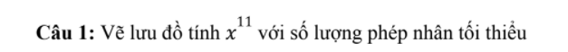

*Bài giải:*

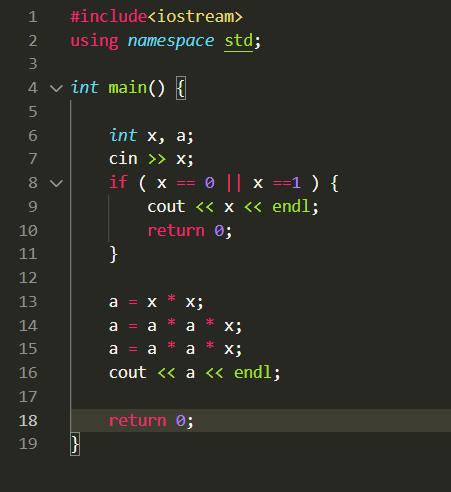

#### Bài 2: 
*Đề bài:*

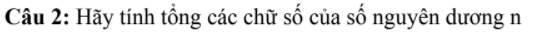

*Bài giải:*

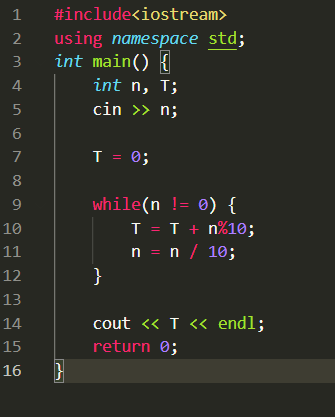

#### Bài 3: 
*Đề bài:*

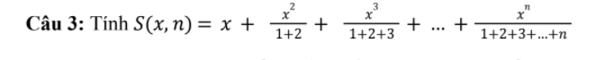

*Bài giải:*

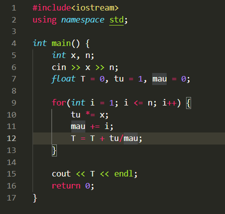

#### Bài 4: 
*Đề bài:*

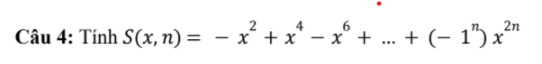

*Bài giải:*

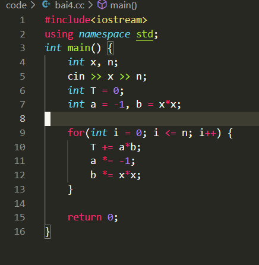

#### Bài 5: 
*Đề bài:*

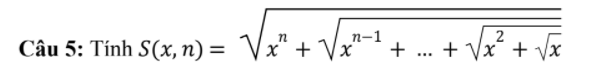

*Bài giải:*

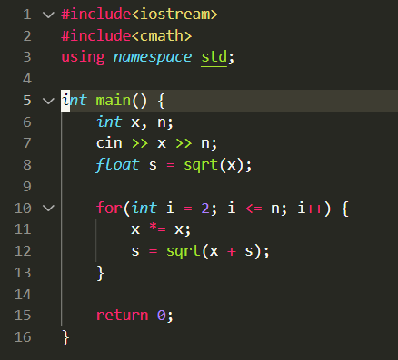

#### Bài 6: 
*Đề bài:*

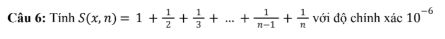

*Bài giải:*

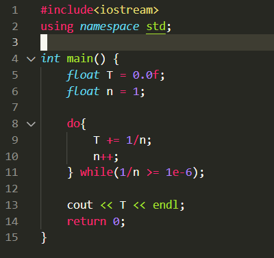

#### Bài 7: 
*Đề bài:*

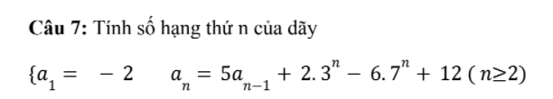

*Bài giải:*

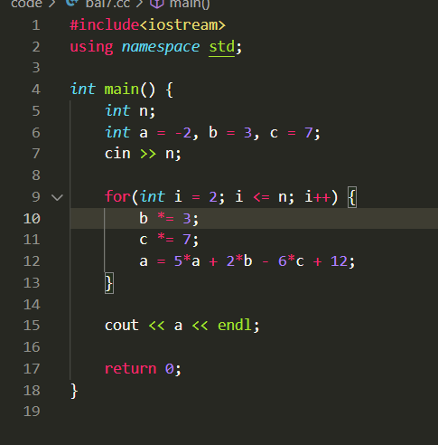

#### Bài 8: 
*Đề bài:*

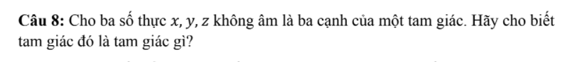

*Bài giải:*

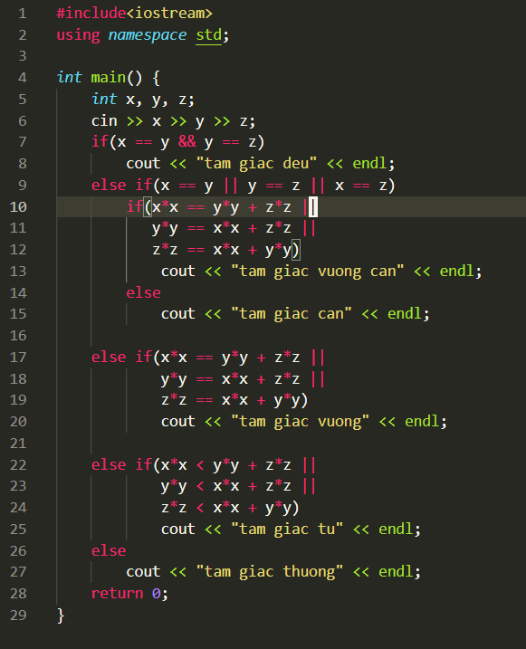

#### Bài 9: 
*Đề bài:*

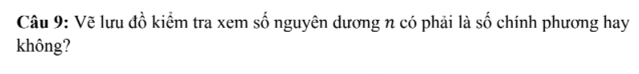

*Bài giải:*

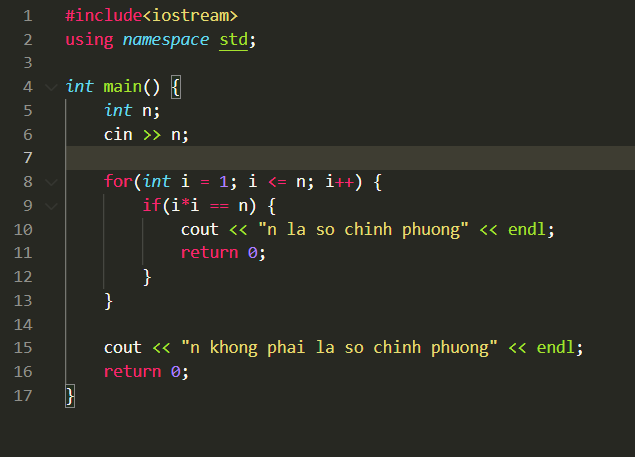

#### Bài 10 (Cách 1): 
*Đề bài:*

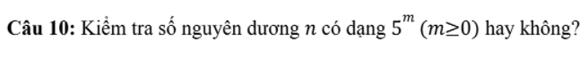

*Bài giải:*

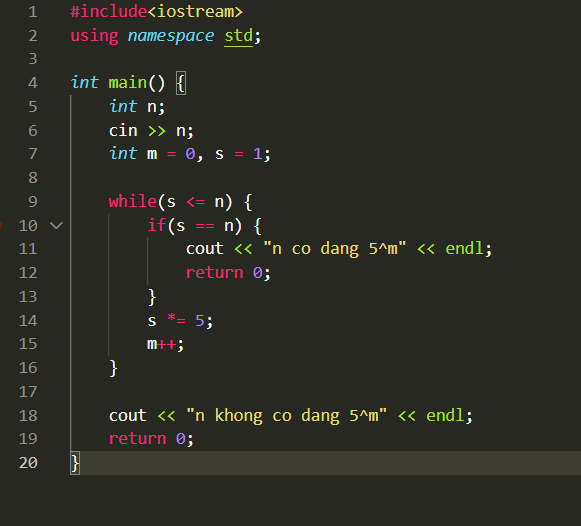

#### Bài 10 (Cách 2):
*Đề bài:*


**Ý tưởng:**

```
Sử dụng log để tìm được m
Sau đó kiểm tra nếu m là số nguyên -> n có dạng 5^m
```

*Bài giải:*

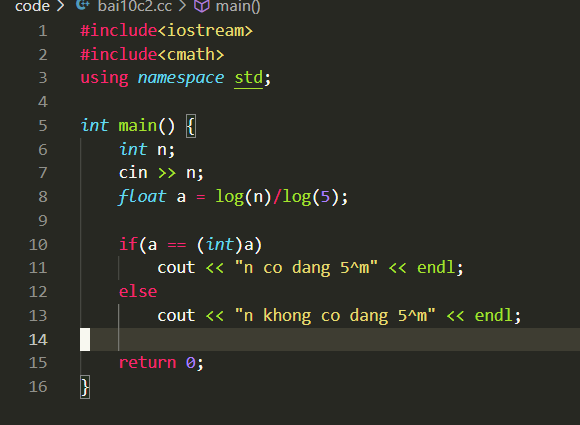
