### Đề bài
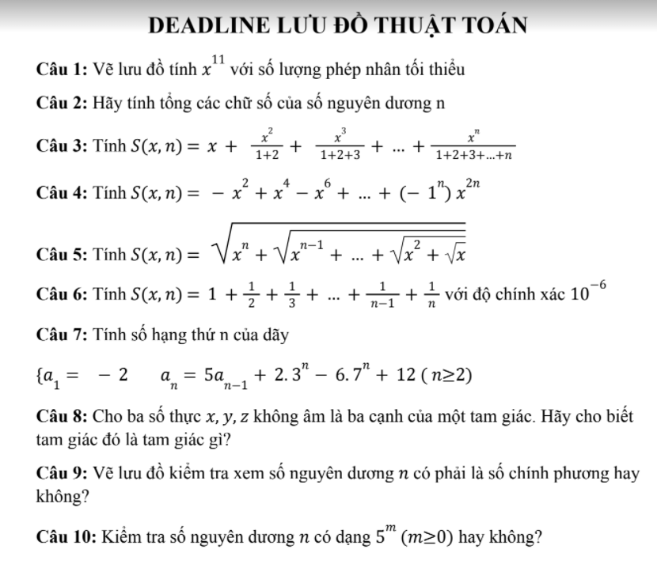
#### Bài 1:
 

**Ý tưởng**: 
```
lấy số mũ chia nhị phân
mũ / 2 = thương (dư)  
tổng số lần nhân = số lần chia 2 + tổng số dư  
```
**Vd:**
```
x^11 -> mũ là 11  
=> 
    11/2 = 5 (1)  
    5 /2 = 2 (1)  
    2 /2 = 1 (0)  

Vậy tổng số lần nhân = 3 + 2 = 5  

Ta có:
    x * x = x^2
    x^2 * x^2 *x = x^5
    x^5 * x^5 * x = x^11  
```
**Lưu đồ:**


#### Bài 2:
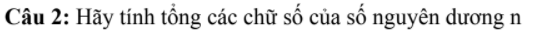

**Ý tưởng**: 

```
sử dụng % (chia lấy dư)  để lấy được số cuối cùng
        / (chia lấy thương) để loại bỏ số cuối cùng
```

**vd:**
```
1234 % 10 = 4
1234 / 10 = 123
```

**Lưu đồ:**


#### Bài 3:
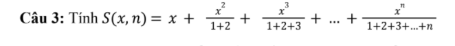

**Ý tưởng:** 
```
dùng vòng lặp để tính các giá trị tử và mẫu 
sau đó tính tổng số mũ của x được nhân tịnh tiến qua từng vòng lặp
```

**Lưu đồ**:


#### Bài 4:
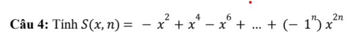

**Ý tưởng:**

```
dùng vòng lặp để tính tổng theo công thức (-1)^n * x^(2*n)
số mũ của x được nhân tịnh tiến qua từng vòng lặp
```

**Lưu đồ**:


#### Bài 5:
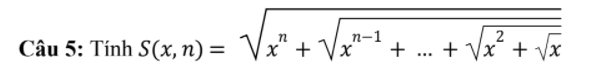

**Ý tưởng:** 

```
dùng vòng lặp để tính 
```

**Lưu đồ:**

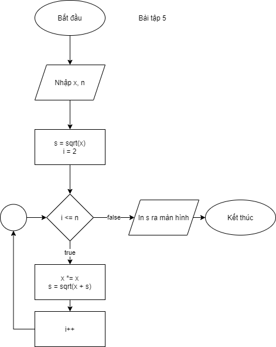

#### Bài 6:


**Ý tưởng**: 
```
điều kiện thực hiện vòng lặp:  1/n >= 1e-6
thực hiện vòng lặp với điều kiện trên
```
**Lưu đồ**:


#### Bài 7:
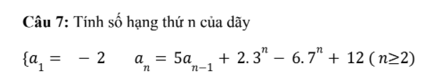

**Ý tưởng**: `sử dụng 2 biến phụ để tính 2x3^n và 6x7^n`

**Lưu đồ**:


#### Bài 8:


**Ý tưởng**: `sử dụng công thức Pytago để xác định loại tam giác`  

**Lưu đồ**:

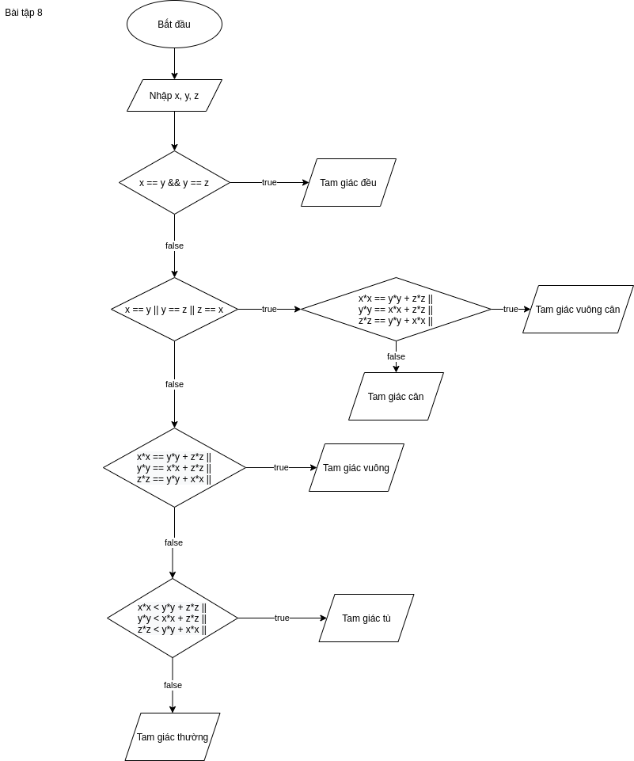

#### Bài 9:


**Ý tưởng**: 

```
số chính phương: biểu thị diện tích của một hình vuông có chiều dài cạnh bằng số tự nhiên
```

**Vd:**

```
cạnh hình vuông = 5 -> diện tích = 25 -> 25 là số chính phương
=> sử dụng vòng lặp tịnh tiến từ i = 0 để tìm số chính phương

```
**Lưu đồ**:

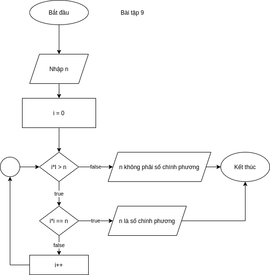

#### Bài 10:
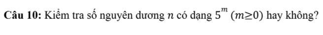

**Ý tưởng**: `sử dụng vòng lặp để tìm m thỏa mãn 5^m == n`  

**Lưu đồ**:

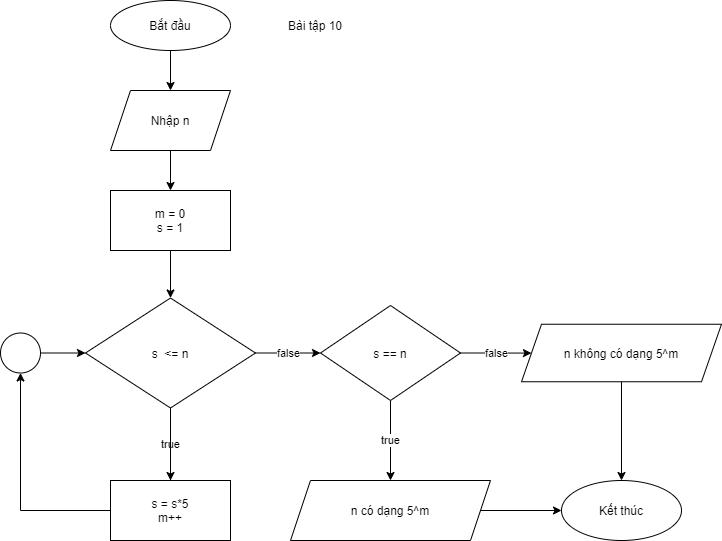
